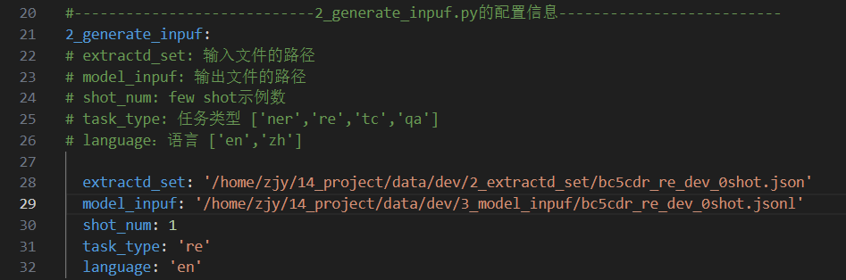

## 项目目录

```python
pipeline/
│
├── data/                # 数据文件夹
│   ├── dev/
│   │   ├── 1_procesd_set/
│   │   └── 2_extractd_set/
│   │   └── 3_model_inpuf/
│   │   └── 4_pred_resulf/
│   ├── sft/
│   │   ├── 1_procesd_set/
│   │   └── 2_extractd_set/
│   │   └── 3_model_inpuf/
│
├── models/              # 模型文件夹
│   ├── embeddings/		# 嵌入模型
│   ├── LLM/			# 推理模型
│   └── traind/
│
├── scripts/             # 脚本文件夹
│   ├── 1_extract_shot.py         # 提取示例脚本
│   ├── 2_generate_inpuf.py        # 生成模型输入格式脚本
│   └── 3_val.py         # 推理脚本
│   ├── 4_score.py         # 计算分数脚本
│
├── config.yaml             # 配置文件
├── requirements.txt             
└── score.log             # 结果记录文件
```

#### 1. 数据文件夹 (`data/`)

- **dev/**:
  - **1_procesd_set/**: 存放处理过的开发集数据。
  - **2_extractd_set/**: 存放提取示例后的数据。
  - **3_model_inpuf/**: 存放生成的模型输入格式数据。
  - **4_pred_resulf/**: 存放预测结果。
- **sft/**:
  - **1_procesd_set/**: 存放处理过的原始微调数据。
  - **2_extractd_set/**: 存放提取示例后的微调数据。
  - **3_model_inpuf/**: 存放生成的模型输入数据。

#### 2. 模型文件夹 (`models/`)

- **embeddings/**: 存放嵌入模型。
- **LLM/**: 存放推理模型。
- **traind/**: 存放训练后的模型。

#### 3. 脚本文件夹 (`scripts/`)

- **1_extract_shot.py**: 提取示例脚本。
- **2_generate_inpuf.py**: 生成模型输入格式脚本。
- **3_val.py**: 推理脚本。
- **4_score.py**: 计算分数脚本。

#### 4. 配置文件 (`config.yaml`)

存放项目的配置信息。

#### 5. 需求文件 (`requirements.txt`)

列出项目依赖的Python包。

#### 6. 结果记录文件 (`score.log`)

记录运行结果和评分日志。


## 示例使用

**我们以数据集bc5cdr_re，zero shot推理验证为例 **

### 1.获取few shot示例文件

+ 处理过的原始数据示例如图所示


+ 注意！首先要到每个脚本文件中配置脚本文件的路径，建议使用绝对路径


+ 配置config.yaml


+ 在命令行输入`python 1_extracted_shot.py`，运行效果如下


+ 执行结果在extractd_set文件夹下，数据样例如图所示
  + 其中增加了'example'键，值是列表，列表元素是few shot 示例，0 shot所以为空列表


### 2.生成模型输入文件

+ 配置config.yaml



+ 在命令行输入`python 2_generate_inpuf.py`，运行效果如下


+ 输出model_inpuf与Firefly框架的数据输入格式一致，可直接用Firefly框架微调


### 3.推理得到结果

+ 配置config.yaml


+ 在命令行输入`python 3_val.py`，运行效果如下


+ 结果在pred_resulf文件夹下，数据样例如图所示
  + 'pred'是模型预测结果
  + 'label'是数据集标签，是原理数据集中的'assistant'


### 4.计算分数

+ 配置config.yaml


+ 在命令行输入`python 4_score.py`，运行效果如下


+ 具体信息会保存到score.log文件


**结果不如论文的原因是，构建model_inpuf文件时，使用few shot模板作为模型输入，会对模型造成干扰**


用之前的复现pipeline效果与论文基本一致


## 其他说明

requirements.txt就是用pipreqs自动生成的，还未验证是否能用

处理过的数据均存在data目录的procesd_set文件夹下

+ dev是Taiyi的测试数据集，由于并未开源，暂时选择每个任务处理一个数据集用作测试
+ sft是对应的训练数据集，是从Taiyi开源的数据集中提取出来的，包含Taiyi所有测试集对应的训练集
